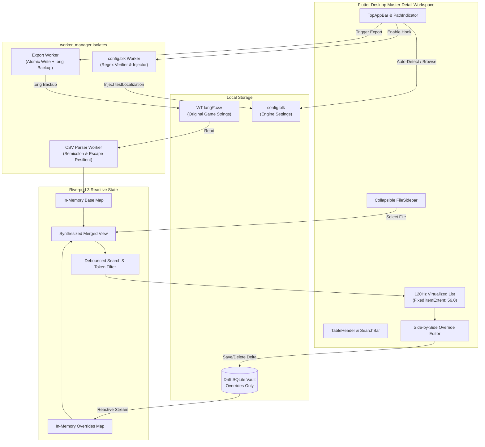

# Gramercy

> **Native War Thunder Localization & Delta-Patching Editor**  
> Ruthless efficiency, zero UI-thread blocking, immutable state synthesis, and a non-destructive delta-patching engine.

[](https://flutter.dev)
[](https://riverpod.dev)
[](https://drift.simonbinder.eu)
[](LICENSE)
[](test/)
[](https://flutter.dev)

---

## 1. Overview

**Gramercy** is a native desktop application designed for War Thunder simulation pilots, tankers, modders, and content creators across **Windows (primary), Linux, and macOS**. It provides an instant, responsive interface to search through 50,000+ game strings, customize vehicle designations, ammunition names, kill feed messages, and menu texts, and deploy them directly into War Thunder without risking broken files or lost changes after game updates.

### The Golden Rule: Delta-Patching Engine
Unlike generic spreadsheet tools or raw text editors that permanently overwrite game files:
- **Base game files are never permanently modified without backups.**
- **Base game strings are never stored in the database.**
- **User customizations are stored purely as delta overrides** in a local SQLite vault.
- **The UI synthesizes Base + Overrides immutably in memory.**
- **Exporting atomically creates safety backups (`.orig`)** before writing modified CSVs back to `<WT_PATH>/lang/`.

---

## 2. Key Features

- **Drift SQLite Delta Vault**: Persistent local storage of custom string overrides (`file_name`, `string_key`, `custom_value`) with compound upsert logic and reactive change streams.
- **Multi-Threaded Isolate Engine**: CSV parsing and export generation run completely off the UI thread via `worker_manager` background isolates.
- **Master-Detail Desktop Workspace**: Collapsible CSV file sidebar with modified count badges, unified top navigation header, sticky search/filter bar, and fixed column headers.
- **120Hz Virtualized Cockpit UI**: Uses fixed-extent virtualization (`itemExtent: 56.0`) with pre-indexed search tokens and 150ms debouncing to scroll smoothly across 50,000+ entries without frame drops.
- **Cross-Platform Auto-Detection**: Automatically detects War Thunder installations on Windows (Steam / Standalone), Linux (Steam default paths), and macOS (Application Support).
- **Non-Destructive Deploy & `.orig` Backups**: Automatically creates `.orig` safety backups before touching game CSV files, preserving all non-English language columns intact.
- **1-Click `config.blk` Hook**: Real-time inspection and safe injection of `testLocalization:b=yes` in War Thunder's `config.blk` debug block.
- **Tactical Aesthetics**: High-density military simulation cockpit styling (dark slate background, tactical amber accents, monospace key labels).

---

## 3. Architecture



---

## 4. Getting Started

### Prerequisites
- **Operating Systems**: Windows 10/11 (x64, primary), Linux (x64), or macOS (Apple Silicon & Intel)
- **War Thunder**: Installed via Steam or Gaijin Standalone Launcher
- **Flutter SDK**: `>= 3.24.0` (with desktop enabled: `flutter config --enable-windows-desktop` / `--enable-linux-desktop` / `--enable-macos-desktop`)

### Building from Source

1. **Clone the repository:**
   ```bash
   git clone git@github.com:Vonarian/gramercy.git
   cd gramercy
   ```

2. **Fetch dependencies:**
   ```bash
   flutter pub get
   ```

3. **Run code generation (Drift):**
   ```bash
   dart run build_runner build --delete-conflicting-outputs
   ```

4. **Run the desktop app:**
   ```bash
   flutter run -d windows
   ```

---

## 5. User Guide

### 1. Locate War Thunder
Click **Auto-Detect** to automatically find your War Thunder installation in standard Steam or Gaijin directories, or click **Browse** to select your custom path.

### 2. Enable Game Localization Hook
Check the **config.blk status pill** in the top navigation header. If localization testing is disabled, click **Enable Hook** to automatically insert `testLocalization:b=yes` into the `debug { ... }` block of your game configuration.

### 3. Select CSV & Browse Strings
Use the file dropdown selector to choose any localization file from War Thunder's `lang/` directory (e.g., `units.csv`, `menu.csv`, `missions.csv`). The list loads instantly with entry counts and modified badges.

### 4. Search and Edit
Type any key or text into the search bar. Click **Edit** on any row to open the side-by-side comparison modal:
- View original base game string.
- Enter your customized name or translation.
- Click **Save Override** (or toggle **Auto-Deploy** to write changes instantly).
- Click **Revert to Stock** at any time to remove your override and restore default game text.

### 5. Deploy to Game
Click **Deploy to Game**. The background worker will create a backup of your original file and safely apply all your delta overrides to `<WT_PATH>/lang/`.

---

## 6. Testing & Quality Assurance

All core business logic, isolate workers, database tables, and state providers are covered by automated unit and widget tests.

```bash
# Run full test suite with coverage
flutter test --coverage

# Run static analysis
flutter analyze
```

---

## 7. Contributing & GitFlow Protocol

This repository follows strict **GitFlow** and **Modularity Budgets** as outlined in [`AGENTS.md`](AGENTS.md):
- **Branches**: Always branch from `dev` (`feat/<name>`, `fix/<name>`, `docs/<name>`).
- **Commits**: Follow the [Conventional Commits](https://www.conventionalcommits.org/) standard (`feat(scope): ...`, `fix(scope): ...`, `docs(scope): ...`).
- **LoC Limits**:
  - Non-test Dart files: **≤ 200 lines**.
  - Functions / methods: **≤ 40 lines**.
  - Widget `build()` methods: **≤ 50 lines**.
  - Test files: **≤ 400 lines**.

---

## 8. License

Distributed under the terms of the **GNU General Public License v3.0**. See [`LICENSE`](LICENSE) for details.
