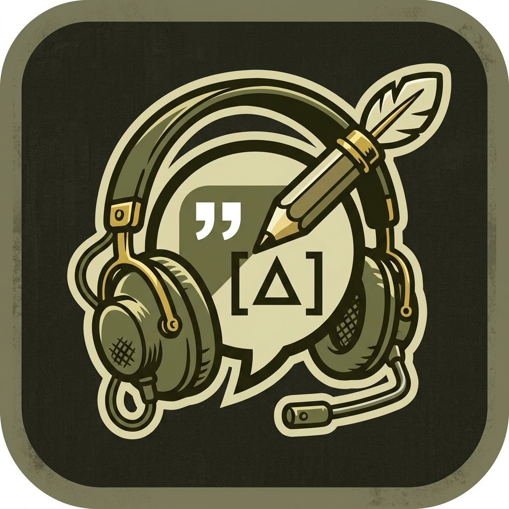
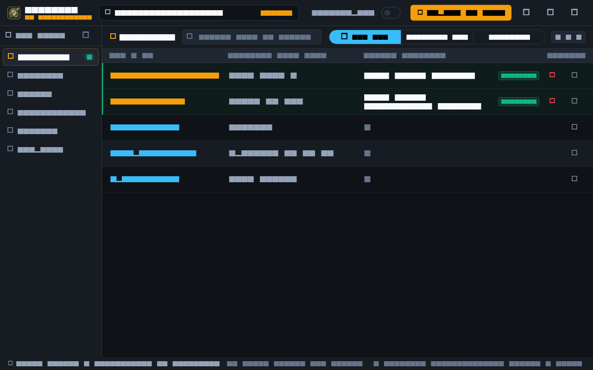
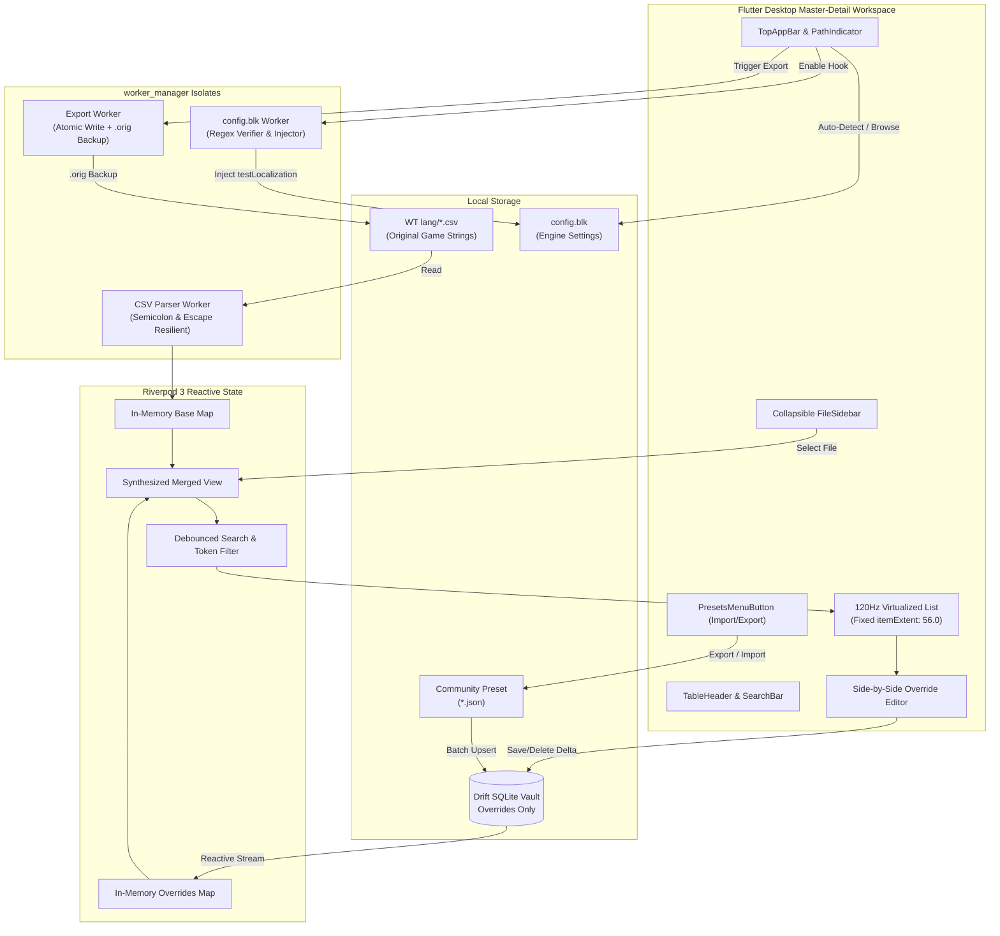

# Gramercy

<div align="center">
  
  <h3>War Thunder Localization Cockpit & Community Delta Vault</h3>
  <p><em>"Gramercy!" &mdash; War Thunder Radio Command [T-4-6] ("Thank you!")</em></p>

  [](https://flutter.dev)
  [](https://riverpod.dev)
  [](https://drift.simonbinder.eu)
  [](https://warthunder.com)
  [](LICENSE)
  [](test/)
  [](https://github.com/Vonarian/gramercy/releases)
  [](https://flutter.dev)
</div>

---

## 1. Overview

**Gramercy** is a native, tactical desktop application engineered for War Thunder pilots, tankers, modders, and squadrons across **Windows (primary), Linux, and macOS**. It delivers an instant, zero-latency cockpit to search, modify, and manage 50,000+ game strings &mdash; vehicle designations, historical ammunition types, kill messages, HUD warnings, and menu texts &mdash; with immutable delta-patching and 1-click game deployment.

<div align="center">
  
</div>

### The Golden Rule: Delta-Patching Engine
Traditional localization modding involves manually editing raw `.csv` files inside `<War Thunder>/lang/`. When Gaijin drops a major patch, those modified files cause game crashes or wipe out all your hard work. 

**Gramercy solves this with Delta Synthesis**:
- **Stock game files are never permanently overwritten.**
- **Stock strings are never stored in the database.**
- **Your customizations live safely as delta overrides** in an isolated SQLite database.
- **The UI synthesizes Base + Overrides immutably in real time.**
- **Deployments automatically create safety backups (`.orig`)** before writing modified CSVs.

---

## 2. 100% BattlEye Anti-Cheat (BEAC) Safe

> [!NOTE]
> **Can I get banned for using custom localizations?**  
> **No.** Custom localizations are an officially documented feature provided by Gaijin Entertainment.

- **Official Client Hook**: War Thunder natively supports custom language files via the `testLocalization:b=yes` setting inside `config.blk`.
- **Zero Memory Injection**: Gramercy never interacts with game memory, processes, or network traffic.
- **Pure Text Manipulation**: Gramercy strictly edits the plain CSV text files inside the game's official `lang/` folder.
- **BattlEye Anti-Cheat (BEAC) Compliant**: BEAC only inspects process memory and game binaries; text CSV modifications under `testLocalization` are fully permitted by Gaijin and BEAC.

---

## 3. Key Features

- **Drift SQLite Delta Vault**: Persistent local storage of custom overrides (`file_name`, `string_key`, `custom_value`) with compound upsert logic and reactive change streams.
- **Community Preset Sharing**: Export your custom string pack into a portable `.json` preset to share with friends, squadrons, or the WT Live community. Import presets with 1-click batch merging.
- **120Hz Virtualized Cockpit UI**: Uses fixed-extent virtualization (`itemExtent: 56.0`) with pre-indexed search tokens and 150ms debouncing to scroll smoothly across 50,000+ entries without frame drops.
- **Multi-Threaded Isolate Engine**: CSV parsing, token filtering, and export generation run completely off the UI thread via `worker_manager` background isolates.
- **Cross-Platform Auto-Detection**: Automatically detects War Thunder installations on Windows (Steam / Standalone), Linux (Steam default paths), and macOS (Application Support).
- **1-Click `config.blk` Hook**: Real-time inspection and safe injection of `testLocalization:b=yes` in War Thunder's `config.blk` debug block.
- **Tactical Aesthetics**: High-density military simulation cockpit styling (dark slate background, tactical amber accents, monospace key labels).

---

## 4. Major Game Update Survival Guide

When War Thunder releases a major update (e.g. *Alpha Strike*, *Dance of Dragons*, *Fire-Seekers*), the game introduces new vehicles, weapons, and strings. If you were using raw edited CSV files, the game would crash or fail to load new text.

With **Gramercy**, surviving updates takes seconds:
1. **Launch War Thunder launcher** and download the game update.
2. (Optional) Delete the `<War Thunder>/lang` folder if Gaijin modified base string layouts; launch the game once to allow War Thunder to generate the latest pristine CSVs.
3. **Open Gramercy** &mdash; your custom modifications are safely preserved in the Delta Vault.
4. Click **Deploy to Game** (or let **Auto-Deploy** do it). All your custom vehicle names and historical tweaks are instantly stamped onto the new update!

---

## 5. Community Presets (Import & Export)

Gramercy makes sharing localization packs simple:

```
Top Bar ➔ [Share Icon] ➔ "Export Preset (.json)" / "Import Preset (.json)"
```

- **Exporting**: Serializes your active overrides across all CSV files into a compact, human-readable JSON schema (`gramercy_preset_v1`).
- **Importing**: Select any community `.json` pack. Gramercy validates the schema and performs an atomic batch upsert into your local database.

---

## 6. Windows SmartScreen Advisory

When downloading release executables on Windows, you may encounter a blue **Windows protected your PC** (SmartScreen) warning:

> **Why does this happen?**  
> Gramercy is an independent, free open-source project. Code signing certificates for Windows cost hundreds of dollars per year, which we choose not to pass on to the community.
>
> **How to launch:**  
> Click **"More info"** ➔ Click **"Run anyway"**. The binary is built transparently via GitHub Actions from this open-source codebase.

---

## 7. Architecture



---

## 8. Download & Installation

### Pre-Built Desktop Binaries

Download the ready-to-run package for your platform from the **[Latest Release](https://github.com/Vonarian/gramercy/releases/latest)**:

| Platform | Package Archive | Quick Start |
| :--- | :--- | :--- |
| **Windows** (10 / 11 x64) | `gramercy-windows-x64.zip` | Extract archive, open folder, and run `gramercy.exe`. *(See [SmartScreen Advisory](#6-windows-smartscreen-advisory))* |
| **Linux** (x64) | `gramercy-linux-x64.tar.gz` | Extract with `tar -xzf gramercy-linux-x64.tar.gz` and run `./gramercy`. |
| **macOS** (Universal) | `gramercy-macos.zip` | Extract archive and move `gramercy.app` to your Applications folder. |

---

## 9. Building from Source

### Prerequisites
- **Operating Systems**: Windows 10/11 (x64, primary), Linux (x64), or macOS (Apple Silicon & Intel)
- **War Thunder**: Installed via Steam or Gaijin Standalone Launcher
- **Flutter SDK**: `>= 3.24.0` (with desktop enabled)

### Build Instructions

1. **Clone the repository:**
   ```bash
   git clone git@github.com:Vonarian/gramercy.git
   cd gramercy
   ```

2. **Fetch dependencies:**
   ```bash
   flutter pub get
   ```

3. **Run code generation (Drift):**
   ```bash
   dart run build_runner build --delete-conflicting-outputs
   ```

4. **Run the desktop app:**
   ```bash
   flutter run -d windows
   ```

---

## 10. Quality Assurance & AGENTS.md Standards

Gramercy is maintained under strict engineering constraints:
- **Test-Driven Development**: 100% test pass with $\ge 80\%$ line coverage on domain, DAOs, and state providers.
- **Strict LoC Ceilings**: Every non-test Dart file $\le 200$ lines, methods $\le 40$ lines, widget `build()` $\le 50$ lines, test files $\le 400$ lines.
- **Zero Static Analysis Warnings**: Verified with `flutter analyze`.

```bash
# Run formatting check
dart format --output=none --set-exit-if-changed .

# Run static analysis
flutter analyze

# Run full test suite with coverage
flutter test --coverage
```

---

## 11. License

Distributed under the terms of the **GNU General Public License v3.0**. See [`LICENSE`](LICENSE) for details.
