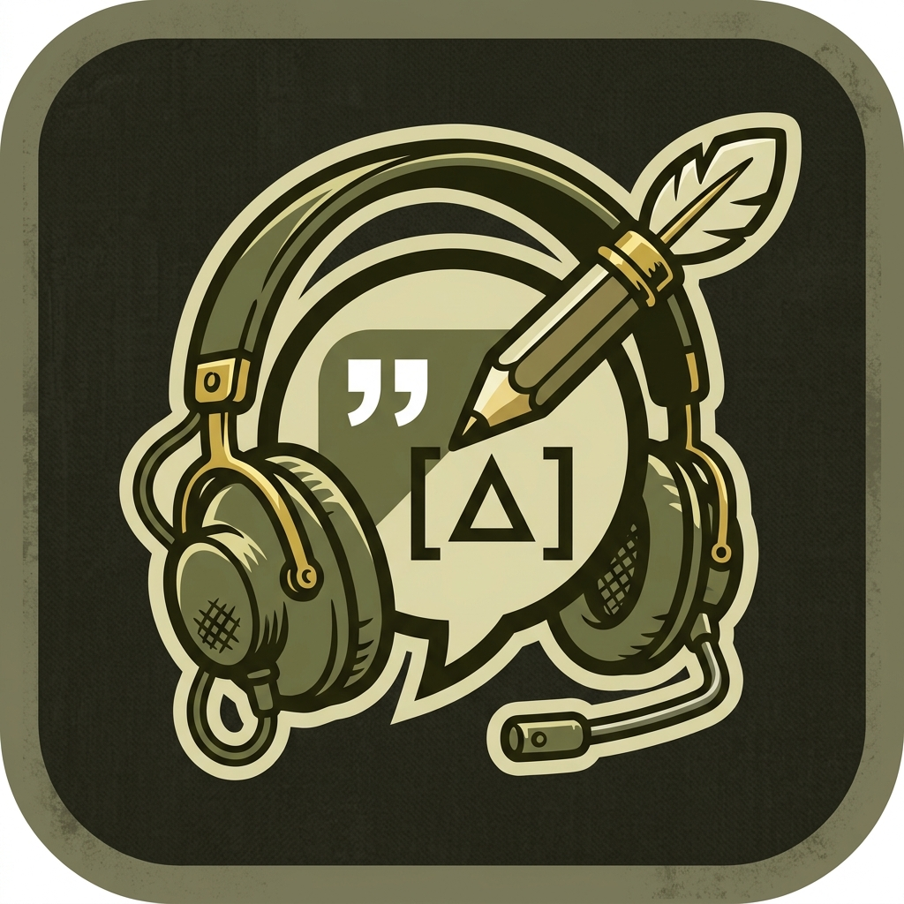
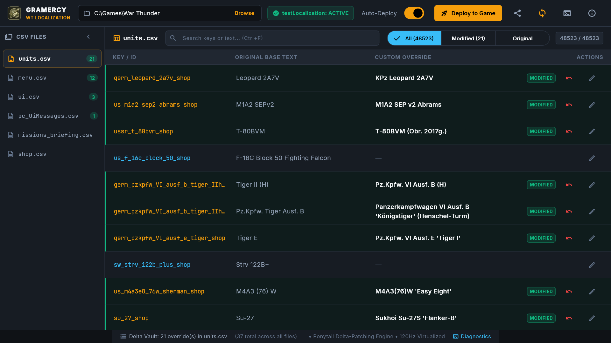
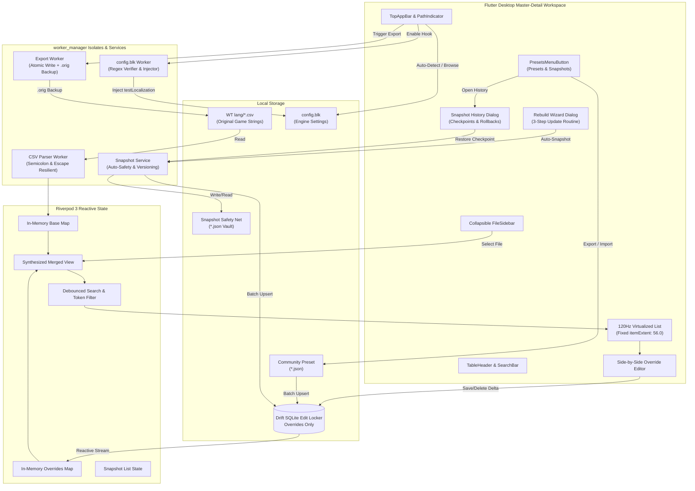

# Gramercy

<div align="center">
  
  <h3>War Thunder Localization Cockpit & Community Delta Vault</h3>
  <p><em>"Gramercy!" &mdash; War Thunder Radio Command [T-3-4] ("Thank you!")</em></p>

  [](https://flutter.dev)
  [](https://riverpod.dev)
  [](https://drift.simonbinder.eu)
  [](https://warthunder.com)
  [](LICENSE)
  [](test/)
  [](https://github.com/Vonarian/gramercy/releases)
  [](https://flutter.dev)
</div>

---

## 1. Overview: Dominate Your Localization

**Gramercy** is the high-performance desktop cockpit engineered for War Thunder pilots, tankers, modders, and squadrons on **Windows (primary), Linux, and macOS**. 

Rename any tank, jet, helicopter, or ship. Personalize kill feed messages, install anime and meme packs, or calibrate tactical HUD callouts in seconds. All with **0 in-game FPS drop**, **0 game crashes**, and **100% BattlEye Anti-Cheat (BEAC) safety**.

<div align="center">
  
</div>

### Stop Breaking Your Game: The Old Way vs. The Gramercy Way

| The Old Raw CSV Way | The Gramercy Way |
| :--- | :--- |
| **Manual File Hacking**: Digging through `<War Thunder>/lang/` with Notepad or Excel. | **Instant Cockpit**: Search 50,000+ strings with real-time token filtering and 120Hz smooth scrolling. |
| **Crash Prone**: One misplaced semicolon or unescaped quote breaks the game on launch. | **Surgical Patching**: Validated CSV parser and atomic export with automatic `.orig` safety backups. |
| **Updates Wipe Everything**: When Gaijin drops a patch, all your custom names disappear or cause crashes. | **Armor-Plated Edit Locker**: Customizations live outside the game directory. Stock files are never permanently overwritten. |
| **No Safety Net**: Make a mistake or lose your edits, and you must reinstall or verify files via Steam. | **Automated Snapshot Safety Net**: Pre-update auto-snapshots and 1-click version rollback. |

---

## 2. 100% BattlEye Anti-Cheat (BEAC) Safe

> [!NOTE]
> **Can I get banned for using custom localizations?**  
> **No.** Custom localizations are an officially documented feature provided by Gaijin Entertainment.

- **Official Client Hook**: War Thunder natively supports custom language files via the `testLocalization:b=yes` setting inside `config.blk`.
- **Zero Memory Injection**: Gramercy never interacts with game memory, running processes, or network traffic.
- **Pure Text File Modification**: Gramercy strictly edits the plain CSV text files inside the game's official `lang/` folder.
- **BattlEye Anti-Cheat (BEAC) Compliant**: BEAC only inspects process memory and game binaries; text CSV modifications under `testLocalization` are fully permitted by Gaijin and BEAC.

---

## 3. Key Player Features

### 🛡️ Armor-Plated Edit Locker
Your customizations live in an isolated SQLite vault stored in your PC's user profile, completely outside the War Thunder directory. Original stock game files are never permanently overwritten, stock text is never polluted, and game uninstalls or Steam updates cannot delete your progress.

### ⚡ Instant 50,000+ String Cockpit
Search through 50,000+ vehicles, munitions, radio commands, and kill messages with instant response and zero lag. Powered by fixed-extent virtualization and multi-threaded background workers (`worker_manager` isolates), your PC never drops a frame even while filtering massive dictionaries.

### 🎯 Surgical Patching
Only your custom words are injected into the game; everything else stays pure vanilla War Thunder. Every export automatically generates a timestamped `.orig` backup before writing modified CSVs, giving you a fail-safe fallback at all times.

### 🚀 1-Click Game Enabler
Forget digging through game folders with text editors. Gramercy detects your War Thunder installation and toggles War Thunder's official custom localization hook (`testLocalization:b=yes`) in `config.blk` with one click.

### 📦 Community Presets (Squadron & WT Live Sharing)
Share your custom setups with squadron mates or the WT Live community with 1-click export and import of `.json` preset packs. Swap between realistic military designations, meme kill feeds, anime voice packs, or competitive tournament callouts in seconds.

### 🔄 Automated Snapshot Safety Net
Before any cache purge or major rebuild, Gramercy automatically captures a timestamped snapshot of your edits into an external vault. If anything ever gets out of sync, open the **Snapshot History** dialog to inspect or roll back to any previous state with a single click.

---

## 4. Major Update Survival Guide

When War Thunder releases a major update (*Alpha Strike*, *Dance of Dragons*, *Sons of Attila*, etc.), Gaijin introduces new vehicles, mechanics, and text strings. With traditional raw CSV edits, the game crashes or displays broken missing text IDs (e.g. `hud/kill_message_0`).

With **Gramercy**, your customizations survive every single update in 3 simple steps:

```
[1] Download Update ➔ [2] In Gramercy: Purge Cache ➔ [3] Launch WT to Hangar ➔ Reload & Apply
```

1. **Download the Game Update** in the War Thunder launcher or Steam.
2. In Gramercy's top bar, click the **Rebuild Game Strings** icon (`Sync` button):
   - **Click "Purge Cache"**: Gramercy automatically captures an **Automated Safety Snapshot** of your active customizations, verifies the game is closed, and clears out old CSVs and `localization.blk`.
3. **Launch War Thunder once** to the hangar:
   - The game detects `testLocalization:b=yes` and automatically dumps fresh, vanilla CSVs with the new update's strings.
   - Gramercy live-detects when the game finishes dumping.
4. **Click "Reload & Apply"**:
   - Gramercy reloads the fresh game strings and instantly stamps all your preserved customizations from your Edit Locker onto the update!

> [!TIP]
> **Need to revert or check an earlier setup?**  
> Open **Presets ➔ Snapshot History...** from the top bar to browse all automatic and manual checkpoints, view customized string counts, and restore previous snapshots with one click.

---

## 5. Community Presets & Snapshot Checkpoints

### Sharing & Installing Presets

```
Top Bar ➔ [Presets Menu] ➔ "Export Preset (.json)" / "Import Preset (.json)"
```

- **Exporting**: Serializes all your active overrides across all CSV files into a compact, human-readable JSON file (`gramercy_preset_v1`). Perfect for sharing on WT Live, Discord, or with squadron mates.
- **Importing**: Select any community `.json` pack. Gramercy validates the schema and performs an atomic batch upsert into your Edit Locker without overwriting unrelated custom strings.

### Managing Checkpoints via Snapshot History

```
Top Bar ➔ [Presets Menu] ➔ "Snapshot History..."
```

- **Automated Checkpoints**: Every time you purge the localization cache before an update, Gramercy automatically archives a `Pre-Update Purge` snapshot.
- **Manual Checkpoints**: Click **+ Create Snapshot** to capture a named restore point whenever you want to test experimental changes.
- **1-Click Rollback**: Select any snapshot and hit **Restore** to immediately write those overrides back into your Edit Locker.

---

## 6. Windows SmartScreen Advisory

When downloading release executables on Windows, you may encounter a blue **Windows protected your PC** (SmartScreen) dialog:

> **Why does this happen?**  
> Gramercy is an independent, free open-source project. Code signing certificates for Windows cost hundreds of dollars per year, which we choose not to pass on to the community.
>
> **How to launch:**  
> Click **"More info"** ➔ Click **"Run anyway"**. The binary is built transparently via GitHub Actions from this open-source codebase.

---

## 7. Under the Hood: Architecture

For developers, contributors, and technical modders, Gramercy is structured around an immutable delta synthesis pipeline:


```mermaid
flowchart TD
    subgraph Disk [Local Storage]
        WTCSV["WT lang/*.csv\n(Original Game Strings)"]
        WTConfig["config.blk\n(Engine Settings)"]
        DB[(Drift SQLite Edit Locker\nOverrides Only)]
        SnapshotVault["Snapshot Safety Net\n(*.json Vault)"]
        PresetFile["Community Preset\n(*.json)"]
    end

    subgraph Background [worker_manager Isolates & Services]
        ParserWorker["CSV Parser Worker\n(Semicolon & Escape Resilient)"]
        ExportWorker["Export Worker\n(Atomic Write + .orig Backup)"]
        HookWorker["config.blk Worker\n(Regex Verifier & Injector)"]
        SnapService["Snapshot Service\n(Auto-Safety & Versioning)"]
    end

    subgraph Memory [Riverpod 3 Reactive State]
        BaseMap["In-Memory Base Map"]
        OverrideMap["In-Memory Overrides Map"]
        Synth["Synthesized Merged View"]
        Filter["Debounced Search & Token Filter"]
        SnapList["Snapshot List State"]
    end

    subgraph UI [Flutter Desktop Master-Detail Workspace]
        TopBar["TopAppBar & PathIndicator"]
        PresetBtn["PresetsMenuButton\n(Presets & Snapshots)"]
        SnapshotModal["Snapshot History Dialog\n(Checkpoints & Rollbacks)"]
        RebuildModal["Rebuild Wizard Dialog\n(3-Step Update Routine)"]
        Sidebar["Collapsible FileSidebar"]
        Header["TableHeader & SearchBar"]
        AppUI["120Hz Virtualized List\n(Fixed itemExtent: 56.0)"]
        EditModal["Side-by-Side Override Editor"]
    end

    WTCSV -->|Read| ParserWorker
    ParserWorker --> BaseMap
    DB -->|Reactive Stream| OverrideMap
    BaseMap --> Synth
    OverrideMap --> Synth
    Synth --> Filter
    Filter --> AppUI
    Sidebar -->|Select File| Synth
    TopBar -->|Auto-Detect / Browse| WTConfig
    TopBar -->|Trigger Export| ExportWorker
    AppUI --> EditModal
    EditModal -->|Save/Delete Delta| DB
    ExportWorker -->|.orig Backup| WTCSV
    TopBar -->|Enable Hook| HookWorker
    HookWorker -->|Inject testLocalization| WTConfig
    PresetBtn -->|Export / Import| PresetFile
    PresetFile -->|Batch Upsert| DB
    PresetBtn -->|Open History| SnapshotModal
    RebuildModal -->|Auto-Snapshot| SnapService
    SnapService -->|Write/Read| SnapshotVault
    SnapshotModal -->|Restore Checkpoint| SnapService
    SnapService -->|Batch Upsert| DB
```

### Architectural Highlights
- **Immutable Delta Synthesis**: Stock strings from `lang/*.csv` and user customizations from Drift SQLite never mix in permanent storage. The runtime synthesizes `BaseMap + OverrideMap` immutably on the fly.
- **Worker Isolates**: CPU-intensive CSV parsing, tokenized search filtering, and disk exports are dispatched to background isolates via `worker_manager`, keeping UI frame times under 8.3ms (120Hz).
- **Safe Atomic Exports**: Exports write to temporary swap buffers and copy cleanly to destination CSVs after generating `.orig` backups, ensuring partial writes or power cuts cannot corrupt game files.

---

## 8. Download & Installation

### Pre-Built Desktop Binaries

Download the ready-to-run package for your platform from the **[Latest Release](https://github.com/Vonarian/gramercy/releases/latest)**:

| Platform | Package Archive | Quick Start |
| :--- | :--- | :--- |
| **Windows** (10 / 11 x64) | `gramercy-windows-x64.zip` | Extract archive, open folder, and run `gramercy.exe`. *(See [Windows SmartScreen Advisory](#6-windows-smartscreen-advisory))* |
| **Linux** (x64) | `gramercy-linux-x64.tar.gz` | Extract with `tar -xzf gramercy-linux-x64.tar.gz` and run `./gramercy`. |
| **macOS** (Universal) | `gramercy-macos.zip` | Extract archive and move `gramercy.app` to your Applications folder. |

---

## 9. Building from Source

### Prerequisites
- **Operating Systems**: Windows 10/11 (x64, primary), Linux (x64), or macOS (Apple Silicon & Intel)
- **War Thunder**: Installed via Steam or Gaijin Standalone Launcher
- **Flutter SDK**: `>= 3.24.0` (with desktop enabled)

### Build Instructions

1. **Clone the repository:**
   ```bash
   git clone git@github.com:Vonarian/gramercy.git
   cd gramercy
   ```

2. **Fetch dependencies:**
   ```bash
   flutter pub get
   ```

3. **Run code generation (Drift):**
   ```bash
   dart run build_runner build --delete-conflicting-outputs
   ```

4. **Run the desktop app:**
   ```bash
   flutter run -d windows
   ```

---

## 10. Quality Assurance & AGENTS.md Standards

Gramercy is maintained under strict engineering constraints defined in [`AGENTS.md`](AGENTS.md):
- **Test-Driven Development (TDD)**: 100% test pass rate with $\ge 80\%$ line coverage across domain logic, DAOs, and state providers.
- **Strict LoC Ceilings**: Every non-test Dart source file $\le 200$ lines, methods $\le 40$ lines, widget `build()` methods $\le 50$ lines, and test files $\le 400$ lines.
- **Zero Static Analysis Warnings**: Verified with `flutter analyze`.
- **Mandatory Formatting**: Verified with `dart format --output=none --set-exit-if-changed .`.

```bash
# Verify formatting
dart format --output=none --set-exit-if-changed .

# Run static analysis
flutter analyze

# Run full test suite with coverage
flutter test --coverage
```

---

## 11. License

Distributed under the terms of the **GNU General Public License v3.0**. See [`LICENSE`](LICENSE) for details.
