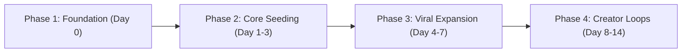

# Gramercy Go-To-Market & Launch Playbook

## 1. Executive Summary

- **Product:** Gramercy (War Thunder Localization Cockpit & Community Delta Vault)
- **Current Version:** v1.4.0
- **Target Audience:** War Thunder modders, simulation pilots/tankers, competitive squadrons, and content creators.
- **Primary Value Prop:** *Stop breaking your game on patch day.* Preserves custom names and kill feeds across game updates with zero UI lag and 100% BattlEye safety.
- **Key Distribution Channels:**
  1. War Thunder Live (`live.warthunder.com`)
  2. Reddit (`r/Warthunder`, `r/warthundermemes`)
  3. Short-Form Video (TikTok, YouTube Shorts, Reels)
  4. Content Creator & Squadron Outreach
  5. Official Gaijin Forums (Community Corner / Tools)

---

## 2. Launch Timeline & Phased Execution

### Phase 1: Foundation & Asset Readiness (Day 0)
- [x] Bundle Starter Presets in release (`presets/meme_killfeed_pack.json`, `presets/historical_realistic_designations.json`).
- [x] Verify preset schema deserialization in test suite.
- [ ] Ensure Windows, Linux, and macOS release zips are uploaded to GitHub Releases v1.4.0 with presets included.
- [ ] Prepare 1-2 high-res GIF / MP4 recordings of the cockpit filtering strings and running the 3-step update rebuild.

### Phase 2: Community Seeding (Days 1–3)
- **Day 1: War Thunder Live Release**
  - Publish listing on `live.warthunder.com` under *Other / Mods & Tools* using [`WAR_THUNDER_LIVE_POST.md`](WAR_THUNDER_LIVE_POST.md).
  - Include screenshots and the downloadable starter presets.
- **Day 2: Reddit Launch (`r/Warthunder`)**
  - Post the community showcase using [`REDDIT_LAUNCH_POST.md`](REDDIT_LAUNCH_POST.md) during peak EU/US gaming hours (14:00 - 18:00 UTC).
  - Actively monitor and respond to comments, address BattlEye questions immediately.
- **Day 3: Reddit Meme Push (`r/warthundermemes`)**
  - Post the patch-day comparison meme to drive organic humor-driven traffic.

### Phase 3: Short-Form Viral Push (Days 4–7)
- Produce and publish Video 1 (*"The Meme Kill Feed"*) and Video 2 (*"Stop Breaking Your Game on Patch Day"*) on TikTok and YouTube Shorts using [`SHORT_FORM_VIDEO_SCRIPTS.md`](SHORT_FORM_VIDEO_SCRIPTS.md).
- Pin download link / GitHub repo in top comment and TikTok bio.

### Phase 4: Creator Partnerships & Squadrons (Days 8–14)
- Direct outreach to 5–10 War Thunder creators using [`CREATOR_OUTREACH_KIT.md`](CREATOR_OUTREACH_KIT.md).
- Post announcement in top War Thunder community and squadron Discords.
- Curate incoming community presets for inclusion in subsequent patch releases.

---

## 3. Success Metrics & Key Performance Indicators (KPIs)

| Metric | 7-Day Target | 30-Day Target |
| :--- | :--- | :--- |
| **GitHub Stars** | 50+ | 250+ |
| **Release Downloads (Total)** | 200+ | 1,500+ |
| **WT Live Downloads / Likes** | 100+ downloads | 800+ downloads |
| **Reddit Upvotes (`r/Warthunder`)** | 200+ | 750+ |
| **Short-Form Video Views** | 5,000+ | 50,000+ |
| **Community Presets Created** | 3+ packs | 15+ packs |

---

## 4. Addressing Common Objections (FAQ Playbook)

- **"Will this get me banned?"**
  - *Answer:* No. Custom localization is an officially documented Gaijin feature enabled via `testLocalization:b=yes` in `config.blk`. BattlEye checks process memory, not plain CSVs. Gramercy never touches game memory.
- **"Why does Windows SmartScreen warn me?"**
  - *Answer:* Code signing certificates cost hundreds of dollars annually. Gramercy is 100% free and open-source, built directly on GitHub Actions. Click "More Info" -> "Run anyway".
- **"What happens when the next patch drops?"**
  - *Answer:* Just click "Purge Cache", open War Thunder to hangar once, and hit "Reload & Apply". All your edits are instantly restored.
